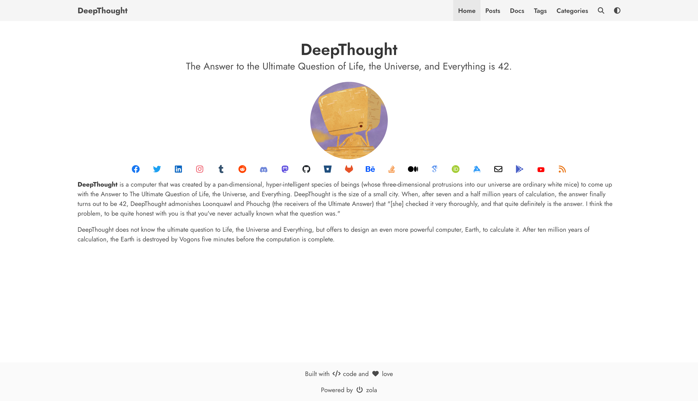

# DeepThought
A simple blog theme focused on writing powered by Bulma and Zola.



## Live Demo
Live version of the website is available at [here](https://deepthought-theme.netlify.app/)

## Installation
Get [Zola](https://www.getzola.org/) and follow their guide on [installing a theme](https://www.getzola.org/documentation/themes/installing-and-using-themes/).
Make sure to add `theme = "DeepThought"` to your `config.toml`

**Check zola version (only 0.9.0+)**
Just to double-check to make sure you have the right version. It is not supported to use this theme with a version under 0.9.0.

## How to serve?
Go into your sites directory, and type `zola serve`. You should see your new site at `localhost:1111`.

 **NOTE**: you must provide the theme options variables in `config.toml` to serve a functioning site

## Deployment
[Zola](https://www.getzola.org) already has great documentation for deploying to [Netlify](https://www.getzola.org/documentation/deployment/netlify/) or [Github Pages](https://www.getzola.org/documentation/deployment/github-pages/). I won't bore you with a regurgitated explanation.

## Multilingual Navbar

If you want to have a multilingual navbar on your blog, you must add your new code language in the [languages](https://www.getzola.org/documentation/content/multilingual/#configuration) array in the `config.toml` file.

**NOTE**: Don't add you default language to this array

```toml
languages = [
    {code = "fr"}, 
    {code = "es"},
]
```

And then create and array of nav item for each language:

**NOTE**: Include your default language in this array

```toml
navbar_items = [
 { code = "en", nav_items = [
  { url = "$BASE_URL/", name = "Home" },
  { url = "$BASE_URL/posts", name = "Posts" },
  { url = "$BASE_URL/docs", name = "Docs" },
  { url = "$BASE_URL/tags", name = "Tags" },
  { url = "$BASE_URL/categories", name = "Categories" },
 ]},
 { code = "fr", nav_items = [
  { url = "$BASE_URL/", name = "Connexion" },
 ]},
 { code = "es", nav_items = [
  { url = "$BASE_URL/", name = "Publicationes" },
  { url = "$BASE_URL/", name = "Registrar" },
 ]}
]
```

en:


fr:


es: 


## Theme Options

```toml
navbar_items = [
 { code = "en", nav_items = [
  { url = "$BASE_URL/", name = "Home" },
  { url = "$BASE_URL/posts", name = "Posts" },
  { url = "$BASE_URL/docs", name = "Docs" },
  { url = "$BASE_URL/tags", name = "Tags" },
  { url = "$BASE_URL/categories", name = "Categories" },
 ]}
]

# Add links to favicon, you can use https://realfavicongenerator.net/ to generate favicon for your site
[extra.favicon]
favicon_16x16 = "/icons/favicon-16x16.png"
favicon_32x32 = "/icons/favicon-32x32.png"
apple_touch_icon = "/icons/apple-touch-icon.png"
safari_pinned_tab = "/icons/safari-pinned-tab.svg"
webmanifest = "/icons/site.webmanifest"

# Author details
[extra.author]
name = "DeepThought"
avatar = "/images/avatar.png"

# Social links
[extra.social]
email = "<email_id>"
facebook = "<facebook_username>"
github = "<github_username>"
gitlab = "<gitlab_username>"
keybase = "<keybase_username>"
linkedin = "<linkedin_username>"
stackoverflow = "<stackoverflow_userid>"
twitter = "<twitter_username>"

# To add google analytics
[extra.analytics]
google = "<your_gtag>"

# To add hyvor comments
[extra.commenting]
hyvor = "<your_hyvor_website_id>"

# To enable mapbox maps
[extra.mapbox]
access_token = "<your_access_token>"

# To enable rendering of KaTeX math formulas
katex.enabled = true
katex.auto_render = true
```

### KaTeX math formula support

This theme contains math formula support using [KaTeX](https://katex.org/),
which can be enabled by setting `katex.enabled = true` in the `extra` section
+of `config.toml`:

```toml
[extra]
katex.enabled = true
katex.auto_render = true
```

After enabling this extension, the `katex` short code can be used in documents:
* `{{ katex(body="\KaTeX") }}` to typeset a math formula inlined into a text,
  similar to `$...$` in LaTeX
* `\KaTeX` to typeset a block of math formulas,
  similar to `$$...$$` in LaTeX

#### Automatic rendering without short codes

Optionally, `\\( \KaTeX \\)` / `$ \KaTeX $` inline and `\\[ \KaTeX \\]` / `$$ \KaTeX $$`
block-style automatic rendering is also supported, if enabled in the config:

```toml
[extra]
katex.enabled = true
katex.auto_render = true
```

## Features
- [x] Dark Mode
- [x] Pagination
- [x] Search
- [x] Charts
- [x] Maps
- [x] Diagrams
- [x] Galleria
- [x] Analytics
- [x] Comments
- [x] Categories
- [x] Social Links
- [x] Post Sharing
- [x] Multilingual Navbar
