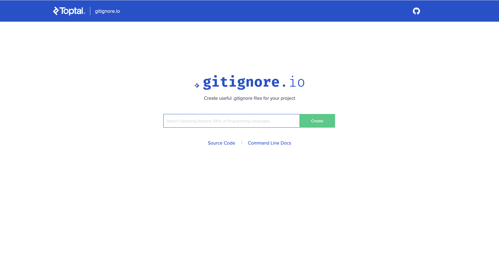

+++
title = "Bootstrap Your .gitignore"
description = "Create .gitignore files for your project using gitignore.io"
date = 2018-08-12T12:20:16+05:30
[taxonomies]
categories = ["Blog"]
tags = ["git", "bootstrapping"]
[extra]
toc = true
+++

Many of us use git to version control our projects and we all can agree on one thing although that despite the benefits git provides, Git is hard = screwing up is easy, and figuring out how to fix your mistakes is really hard.

<!-- more -->

And while working with git it is also important to tell git what files git should not remember thus not version control that, so `.gitignore` comes into the picture.

And there is a really simple way to bootstrap your `.gitignore` using [gitignore.io](https://www.gitignore.io/) just go to the website and fill the technologies you are working on.



Now just click on create and viola your `.gitignore` is ready.


If you are someone who prefers CLI instead of browser and have a working internet connection then you can also make an environment function to generate your `.gitignore` using your terminal.

## Installation 
### Linux
- bash
    ```sh
    $ echo "function gi() { curl -L -s https://www.gitignore.io/api/\$@ ;}" >> ~/.bashrc && source ~/.bashrc
    ```
- zsh
    ```sh
    $ echo "function gi() { curl -L -s https://www.gitignore.io/api/\$@ ;}" >> ~/.zshrc && source ~/.zshrc
    ```
- fish
    ```sh
    $ printf "function gi\n\tcurl -L -s https://www.gitignore.io/api/\$argv\nend\n" > ~/.config/fish/functions/gi.fish
    ```

### macOS
- bash
  ```sh
  $ echo "function gi() { curl -L -s https://www.gitignore.io/api/\$@ ;}" >> ~/.bash_profile && source ~/.bash_profile
  ```
- zsh
  ```sh
  $ echo "function gi() { curl -L -s https://www.gitignore.io/api/\$@ ;}" >> ~/.zshrc && source ~/.zshrc
  ```
- fish
  ```sh
  $ printf "function gi\n\tcurl -L -s https://www.gitignore.io/api/\$argv\nend\n" > ~/.config/fish/functions/gi.fish
  ```

### Windows
- Create a PowerShell v3 Script
  ```posh
  #For PowerShell v3
  Function gig {
    param(
      [Parameter(Mandatory=$true)]
      [string[]]$list
    )
    $params = ($list | ForEach-Object { [uri]::EscapeDataString($_) }) -join ","
    Invoke-WebRequest -Uri "https://www.gitignore.io/api/$params" | select -ExpandProperty content | Out-File -FilePath $(Join-Path -path $pwd -ChildPath ".gitignore") -Encoding ascii
  }
  ```
## Usage

Show output on the command line. **Note:** Use `gig` if you are on Windows

- List all available gitignore.io templates
  ```sh
  $ gi list
  .......
  kobalt,kohana,komodoedit,kotlin,labview
  lamp,laravel,latex,lazarus,leiningen
  lemonstand,less,liberosoc,librarian-chef,libreoffice
  lilypond,linux,lithium,lua,lyx
  m2e,macos,magento,magento2,magic-xpa
  matlab,maven,mavensmate,mean,mercurial
  mercury,metaprogrammingsystem,meteorjs,microsoftoffice,mikroc
  moban,modelsim,modx,momentics,monodevelop
  mplabx,mule,nanoc,nativescript,ncrunch
  nesc,netbeans,nette,nikola,nim
  ninja,node,notepadpp,nwjs,objective-c
  ocaml,octobercms,opa,opencart,opencv
  openfoam,openframeworks,oracleforms,osx,otto
  packer,particle,pawn,perl,perl6
  .......
  ```
- Make your `.gitignore` for the project
  ```sh
  $ gi linux,python >> .gitignore
  ```