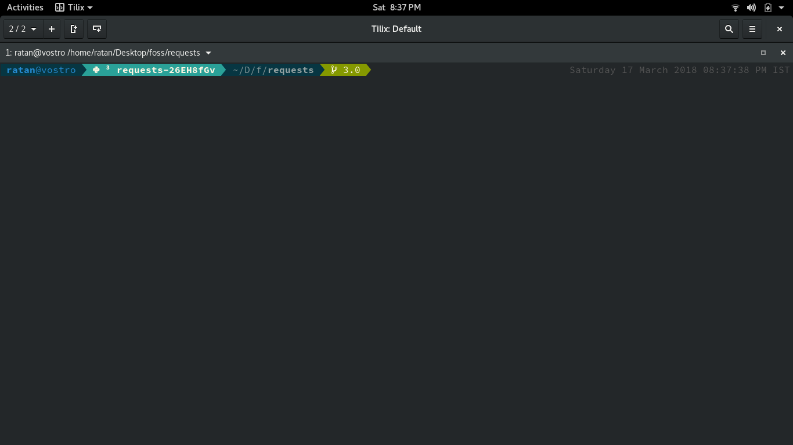

+++
title = "Terminal Customization"
description = "Make your terminal prompt look awesome and helpful."
author = "Ratan Kulshreshtha"
date = 2018-03-17T15:30:43+05:30

[taxonomies]
categories = ["Blog"]
tags = ["terminal", "fish", "git", "prompts"]
+++

I run a Fedora 27 box as of now and I use **Tilix** as my emulator and **fish** as my shell with **Oh My Fish**. **fish** is a smart and user-friendly command line shell and I really love this and you should try it out.

<!-- more -->

To get **fish** on your machine you can go to this [page](https://fishshell.com/) and install fish for your machine, once you have installed fish on your machine you should also install **Oh My Fish** from [here](https://github.com/oh-my-fish/oh-my-fish). And once you have done that you are ready to customize your prompt mine looks like this



I am using bobthefish as my current theme for fish shell with `SauceCodePro Nerd Font Regular` as font, bobthefish is a Powerline-style, Git-aware fish theme optimized for awesome.

To use the theme completely you need to install [nerd-fonts](https://github.com/ryanoasis/nerd-fonts) in your system.

Here is my config.fish.

```fish
# Config options for bobthefish
set -g theme_display_vagrant yes
set -g theme_display_docker_machine no
set -g theme_display_k8s_context yes
set -g theme_display_hg yes
set -g theme_display_user yes
set -g theme_display_hostname yes
set -g theme_display_vi no
set -g theme_title_display_user yes
set -g theme_title_use_abbreviated_path no
set -g theme_avoid_ambiguous_glyphs yes
set -g theme_nerd_fonts yes
set -g theme_show_exit_status yes
set -g default_user your_normal_user
set -g theme_color_scheme solarized-dark
set -x VIRTUAL_ENV_DISABLE_PROMPT 1
```

I hope you find this post usefull and give fish shell a try.